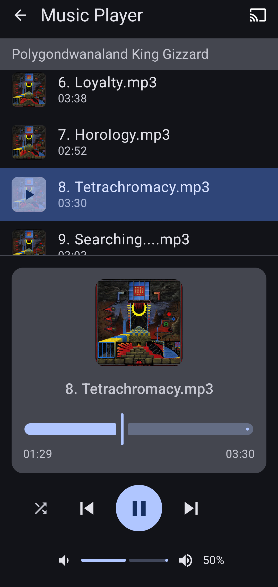

# Music Player

An Android music player with hierarchical folder browsing, Chromecast support, and smart flat-list views for large libraries.

## Features

- Hierarchical folder browser — navigate your storage tree with human-friendly names (Internal Storage, SD Card, etc.)
- Play MP3, WAV, OGG, FLAC, M4A, and other common audio formats
- Playback controls: play/pause, previous/next track, volume up/down
- Shuffle mode with visual indicator (bright yellow when active) and smart auto-scroll
- **All Tracks flat view** — when a folder subtree contains many single-track directories (e.g. an iTunes library of singles), an "All Tracks" chip appears that collapses all leaf-folder tracks into one scrollable list showing artist and title
- **Song search** — search icon in the top bar filters by title, artist, or album within the folder subtree you're currently browsing; tap a result to play it
- **Clean track titles** — files named "artist - album - song" show just the song title in the track list and Now Playing view; tap the Now Playing title for a pop-up with cover art and the full artist / album / song details (dismisses on tap or after 10 seconds)
- Seek bar for track position
- Now Playing view with album art, track info, and seek slider
- Chromecast support — stream to any Cast device on the local network
- System back button navigates up the folder tree (exits only when at the root)

## Installation

Download the latest APK from the [Releases](../../releases) page and install it on your Android device. See [INSTALLATION.md](INSTALLATION.md) for detailed instructions on how to sideload the app.

## Build

```bash
./gradlew assembleDebug
```
## Tech Stack

- Kotlin
- Jetpack Compose with Material 3
- Android MediaPlayer API
- ViewModel with StateFlow



## Album art credit

see:

https://en.wikipedia.org/wiki/Polygondwanaland
